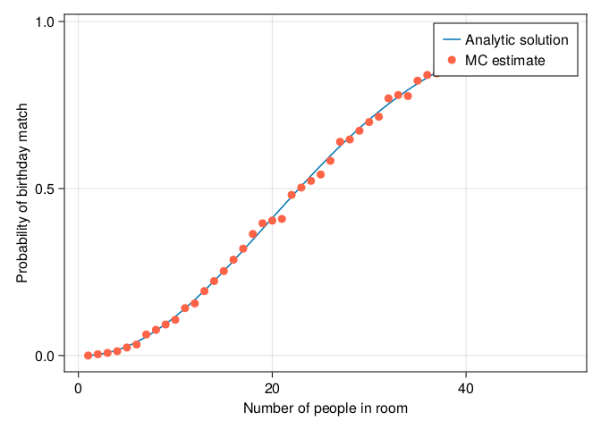

Chapter02 : Statistics with Julia
================
2022/08/16

-   <a href="#even-sum-of-two-dice" id="toc-even-sum-of-two-dice">Even sum
    of two dice</a>
-   <a href="#partially-matching-passwords"
    id="toc-partially-matching-passwords">Partially Matching Passwords</a>
-   <a href="#the-birthday-problem" id="toc-the-birthday-problem">The
    birthday problem</a>

## Even sum of two dice

2つのサイコロを転がして、その和が偶数になる確率を計算し、ランダムな実験と比較する。

``` julia
using Statistics

N, faces = 10^6, 1:6

numSol = sum([iseven(i+j) for i in faces, j in faces]) / length(faces)^2

mcEst = sum([iseven(rand(faces) + rand(faces)) for i in 1:N]) / N 

println("理論値: $numSol, 実験値:$mcEst")
```

    理論値: 0.5, 実験値:0.498898

## Partially Matching Passwords

適当に生成したパスワードが1文字でもヒットする確率。

``` julia
using Random
Random.seed!()

passLength, numMatchesForLog = 8, 1
possibleChars = ['a':'z'; 'A':'Z'; '0':'9']
correctPassword = "3xyZu4vN"

numMatch(loginPassword) = sum([loginPassword[i] == correctPassword[i] for i in 1:passLength])
N = 10^7

passwords = [String(rand(possibleChars,passLength)) for _ in 1:N]
numLogs = sum([numMatch(p) >= numMatchesForLog for p in passwords])

println("Number of login attempts logged: ", numLogs)
println("Proportion of login attempts logged: ", numLogs/N)
```

    Number of login attempts logged: 1219692
    Proportion of login attempts logged: 0.1219692

## The birthday problem

n人が同じ部屋にいる時に、誰か2人以上が同じ誕生日を持つ確率。

``` julia
using StatsBase, Combinatorics, CairoMakie

matchExists1(n) = 1 - prod([k/365 for k in 365:-1:365-n+1])
matchExists2(n) = 1- factorial(365,365-big(n))/365^big(n)

function bdEvent(n)
    birthdays = rand(1:365,n)
    dayCounts = counts(birthdays, 1:365)
    return maximum(dayCounts) > 1
end

N = 10^3
probEst(n) = sum([bdEvent(n) for _ in 1:N])/N

xGrid = 1:50
analyticSolution1 = [matchExists1(n) for n in xGrid]
analyticSolution2 = [matchExists2(n) for n in xGrid]
println("Maximum error: $(maximum(abs.(analyticSolution1 - analyticSolution2)))")

mcEstimates = [probEst(n) for n in xGrid]

fig = Figure()
ax = Axis(fig[1,1], 
    xlabel = "Number of people in room",
    ylabel = "Probability of birthday match"
    )
lines!(ax, xGrid, analyticSolution1, label="Analytic solution")
scatter!(ax, xGrid, mcEstimates, color = :tomato, label="MC estimate")
axislegend(ax)
fig
```

    Maximum error: 2.461172365062727820892938546467205715971256384764337390231064159958270652057059e-16

<figure>

<figcaption aria-hidden="true">図 1: Probability that in a room of n
people, at least two people share a birthday.</figcaption>
</figure>

20数人を超えたところで、既にそのような確率が0.5になる。

40人の段階で理論確率は90％近くに到達する。

``` julia
matchExists1(40)
```

    0.891231809817949
